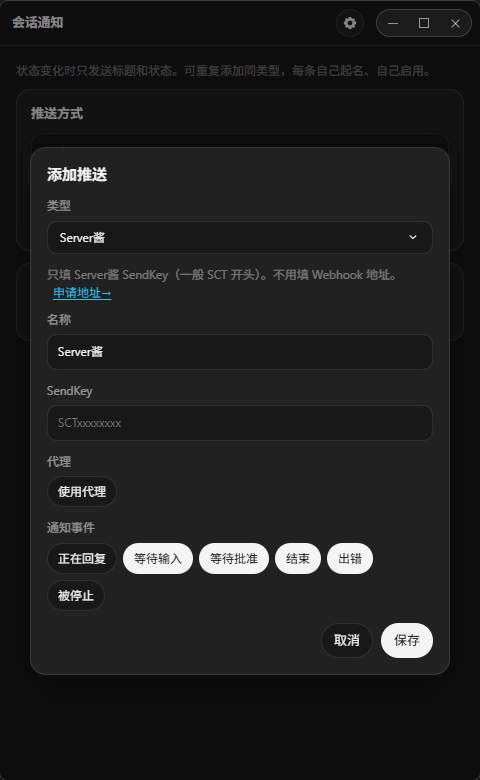

# 会话通知

PI-Desktop 插件。监听**全部会话**的状态变化，把**标题 + 状态**推到你添加的通道。不读消息正文，不接 QQ 官方 API。



- 插件 id：`cc.mcii.session-notify`
- 许可证：[GPL-3.0-only](./LICENSE)
- 源码：https://github.com/LectWolf/pi-session-notify
- 主页：https://plugins.aiuo.net/plugins/cc.mcii.session-notify

## 会推什么

| 状态 | 意思 | 默认 |
| --- | --- | --- |
| 等待输入 | 助手停下来等你说话 | 开 |
| 等待批准 | 助手要跑工具，等你点允许 | 开 |
| 结束 | 这一轮正常完成 | 开 |
| 出错 | 这一轮失败 | 开 |
| 正在回复 | 助手开始干活（生成/调工具）。每次开动都会推，容易刷屏 | 关 |
| 被停止 | 你点了停止，或回合被取消 | 关 |

只在状态**变化**时发送一次。没有全局「启用推送」：每条通道自己开/关。启用中的通道，名称右侧有状态点。右上角设置里 **前台也发送** 默认开；关掉后，PI-Desktop 在前台时不推。

**最近推送**只保留 **5 条**，只在内存里，插件或进程重启后清空。

## 推送方式

面板里 **添加推送**。同类型可加多次（例如两个飞书），每条自己起名。专用类型旁有 **申请地址→**，点击复制官方文档链接。

| 类型 | 你要填的 | 发出去的内容 |
| --- | --- | --- |
| 飞书 | 群机器人 Webhook；签名密钥仅在开了「签名校验」时填 | 飞书文本：`会话名 · 等待输入` |
| 钉钉 | 群机器人 Webhook；加签密钥仅在开了「加签」时填 | 钉钉文本消息 |
| 企业微信 | 群机器人 Webhook 地址 | 企微文本消息 |
| KOOK | 频道 Webhook 地址 | KOOK 文本：`{ type: 1, content }` |
| Server酱 | 只填 SendKey（一般 SCT 开头），不用填 URL | `title` + `desp` |
| Telegram | Bot Token + Chat ID。公开频道可填 `@channelname`；私聊/群必须是数字 ID，不能填个人 `@用户名` | `sendMessage` 文本 |
| 通用 Webhook | 任意 http(s) 地址 | 固定 JSON，见下 |
| 自定义 API | 方法、请求头、正文模板（NapCat / Qmsg 走这条） | 你自己的模板 |

**签名密钥**：飞书/钉钉群机器人的安全设置。没开签名/加签就留空；开了才把后台给的 secret 填进去，用来给请求做 HMAC，不是 Webhook 地址。

每条通道可单独打开 **使用代理**（默认关）。Telegram 在国内通常需要开。代理在面板右上角齿轮里设：默认自动获取系统/环境变量，也可手动填 `http://127.0.0.1:7890`。

### 通用 Webhook 是什么

不是飞书/钉钉那种机器人协议。它只做一件事：往你填的地址 **POST** 一段固定 JSON：

```json
{
  "title": "会话名",
  "status": "waiting_input",
  "statusLabel": "等待输入",
  "sessionId": "abcd1234",
  "at": "2026-04-08T12:00:00.000Z",
  "text": "会话名 · 等待输入"
}
```

适合自己写的接收端、n8n、Make、Cloudflare Worker。飞书/钉钉/企微/KOOK/Server酱/Telegram 请用上面的专用类型。要改 HTTP 方法、请求头或正文模板，用 **自定义 API**。

自定义 API 才用占位符：`{{title}}` `{{status}}` `{{statusLabel}}` `{{sessionId}}` `{{at}}`。

## 安装

1. 打开 [Releases](https://github.com/LectWolf/pi-session-notify/releases)，下载最新的 `cc.mcii.session-notify-*.piplug`
2. PI-Desktop → **插件** → **安装 .piplug**
3. 确认权限：`ui.panel`、`background.service`
4. 命令面板搜「会话通知」

开发加载：插件页 **加载开发插件**，选本目录。

## 自定义 API 示例

### NapCat 私聊

URL：`http://127.0.0.1:3000/send_private_msg`

```json
{"user_id":123456789,"message":"{{title}} · {{statusLabel}}"}
```

### Qmsg

URL：`https://qmsg.zendee.cn/send/你的key`

```json
{"msg":"{{title}} · {{statusLabel}}"}
```

## 权限与安全说明

| 权限 | 用途 |
| --- | --- |
| `ui.panel` | 打开设置面板 |
| `background.service` | 面板关闭后继续轮询 |

只读本机 `pi.sqlite` 的会话标题和 `turns.status`。出站请求只发到你添加的通道，不带消息正文。清单不声明 `net.fetch`，自定义 URL 走插件进程的 Node `http`/`https`。

## 开发

```text
python scripts/pack.py
# → dist/cc.mcii.session-notify-<version>.piplug
```

发版：改 `manifest.json` 的 `version`，提交后打标签并推送。

```text
git tag v1.0.0
git push origin v1.0.0
```

GitHub Actions 会核对 tag 与版本号、打 `.piplug`、创建 Release。

需要 PI-Desktop ≥ 0.2.0。
